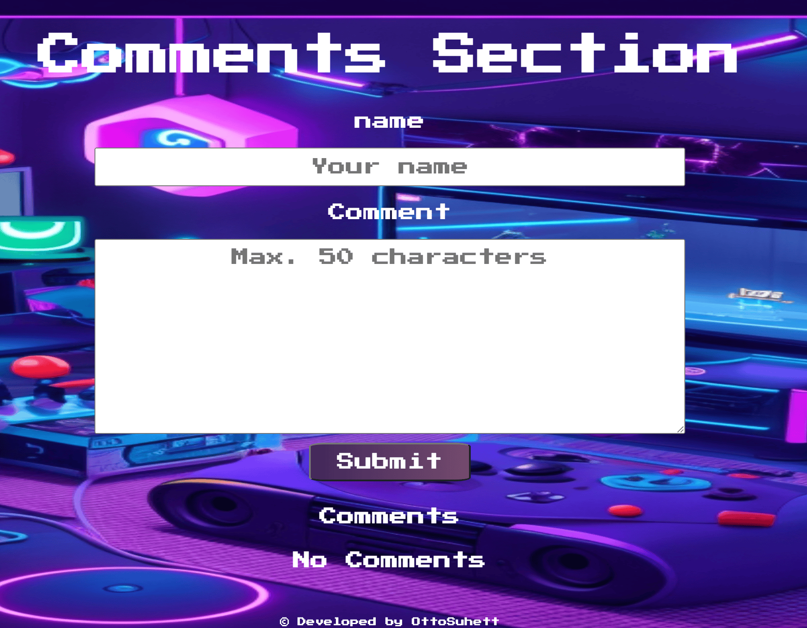

# React Comments Section
 

A responsive web application for registering, storing, and displaying comments. The user can provide their name and write a comment (up to 50 characters) both fields are mandatory. When the user registers a comment, it will appear below, with the most recent comment always at the top. Each comment will display the user's name, date and time of registration, along with the comment enclosed in quotation marks.

## Motivation

The motivation behind this project was to work with state management between components and data manipulation using Local Storage for data storage.I sought to explore and implement the prop validation concept in React. By utilizing the prop-types library, I was able to define and enforce strict rules for the data passed between components, ensuring a higher level of data integrity and reducing potential bugs or errors caused by incorrect prop types

## Technologies Used

The project was built using the following technologies:

- Vite Project
- React
- Sass for styling
- date-fns for handling date and time
- Local Storage for data storage
- prop-types for prop validation

## How to Run the Application

Before running the application on your local machine, ensure you have Node.js installed. If you don't have Node.js installed, follow these instructions to install it:

1. Visit the official Node.js website at [https://nodejs.org/](https://nodejs.org/).
2. Download the appropriate installer for your operating system.
3. Run the installer and follow the installation instructions.

Once you have Node.js installed, follow these steps to run the application:

1. Clone this repository to your local machine.
2. Open a terminal and navigate to the project directory.
3. Install the required dependencies by running the following command:
`npm install`
4. Start the development server by running the following command:
`npm run dev`

5. The application should now be accessible at your localhost

## Usage

To use the React Comments Section application:

1. Enter your name and write a comment in the respective fields.
2. Both name and comment fields are mandatory, so ensure they are filled before registering the comment.
3. Click on the submit button to register the comment.
4. The new comment will appear at the top of the comments section with the user's name, date, and time of registration.

Please note that the application utilizes Local Storage for data storage, so the comments will persist even after you close the application.

## Contributing
If you want to contribute to this project, feel free to fork the repository and submit a pull request with your changes.

Feel free to use and modify the code.